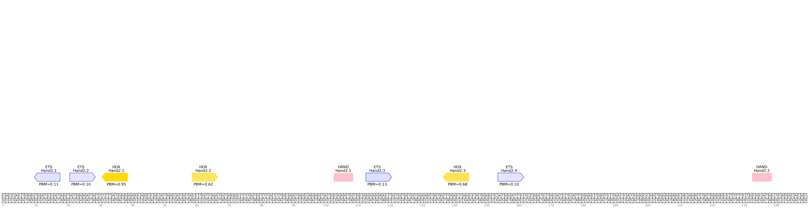

# tfsites.AnnotateAndVisualizeTFSites v1

**Author(s):** Joe Solvason  

**Contact:** Joe Solvason (solvason@eng.ucsd.edu)

**Adapted as a GenePattern Module by:** Ted Liefeld (jliefeld@cloud.ucsd.edu)

**Task Type:** Transciption factor analysis

**LSID:**  urn:lsid:genepattern.org:module.analysis:00442


## Introduction

`AnnotateAndVisualizeTfSites` annotates transcription factor binding sites across a DNA sequence. Multiple transcription factors can be analyzed. Each binding site is labeled with the TF name and a unique binding site ID. If a relative affinity/score dataset from the `DefineTfSites` modules is provided for a transcription factor, the  affinity/score of this site will be labeled and the intensity of the binding site’s color will be proportional to the  affinity/score.


## Methodology

We iterate across every k-mer in the DNA sequence and identify those that conform to the IUPAC definition for transcription factor binding sites. For each binding site, we report its sequence, position, TF name,  affinity/score (if PBM/PFM data is given), direction (“+” if it follows the given binding site definition and “-” if it follows the reverse complement of the binding site definition), and a unique ID. 

Using the binding sites identified in the DNA sequence, an image of the DNA sequence and all annotated binding sites is generated. Each binding site is plotted as a polygon that points in the direction of the site (right for positive, left for negative, and straight for a palindrome sequence).  

If the sequence is greater than 500 nucleotides in length, the annotated images are saved to multiple files. Each file contains a maximum of 500 nucleotides. 


## Parameters

<span style="color: red;">*</span> indicates required parameter

### Inputs and Outputs

- <span style="color: red;">*</span>**DNA sequence(s) to annotate (.tsv)**
    - File containing one or more DNA sequences to be annotated. 
- <span style="color: red;">*</span>**TF information (.tsv)**
    - File containing all the information for the transcription factors being analyzed, including its name, binding site definition, desired color on the plot, any PBM relative affinity data, and any PFM relative score data.
- **all TF reference data**
    - File(s) referenced in the TF information file.     

### Plotting Parameters
- <span style="color: red;">*</span>**output image format (string)**
    - Drop down menu, user can select `Zoom` or `Windows`
    - Select the format in which the images will be outputted. `Zoom` indicates the region of the DNA sequence to visualize, given a start and end coordinate (see zoom range below). `Windows` will output the entire DNA sequence into separate image "windows". The window size, or the number of bases plotted per window, is given by the `window size` option below.
- **zoom range (dash-separated string)**
    - `Default = None`
    - Given a start position and an end position, zoom into a portion of the sequence. The numbers in the range are inclusive and 0-indexed. For example, the first 200 nucleotides of the sequence would be specified as: 0-199.
    - Ignored if `output image format = Windows`
- **window size (integer)**
    - `Default = 500`
    - Interval size (in nucleotides) to separate the output plot into. By default, the sequence will be divided into 500-nucleotide segments.
    - Ignored if `output image format = Zoom`
- **plot dimensions (integer)**
    - `Default = None`
    - Height and width of the image in inches, seperated by a comma. 
- **plot resolution (integer)**
    - `Default = 200`
    - Resolution of the plot, in dots (pixels) per inch

## Input File(s)

1.  DNA Sequence(s) To Annotate (.tsv)
- Columns:
    - `Sequence Name:` name of the DNA sequence
    - `Sequence:` the sequence
 
```
Sequence Name	    Sequence
ZRS                 AACTTTAATGCCTATGTTTGATTTGAAGTCATAGCATAAAAGGTAACATAAGCAACATCCTGACCAATTATCCAAACCATCCAGACATCCCTGAATGGC...
Hand2               CACCACTGGGTGATCCATAGTATGGAATATTTTTATGAGAAACAGCCACATAACATGTACCTGTTAATGTAGGCTTTGTGTTTATTTGCAATAGCAGAG...
```

2. TF information (.tsv)
- Columns:
    - `TF Name:` name of the transcription factor
    - `Binding Site Definition:` minimal IUPAC binding site definition for transcription factor
    - `Color:` binding site color on the output visualization
    - `PBM Reference Data:` relative affinity data obtained from DefineTfSites.from.PBM
    - `PFM Reference Data:` relative score data obtained from DefineTfSites.from.PFM
 
```
TF Name     Binding Site Definition     Color     PBM Reference Data           PBM Reference Data
ETS         NNGGAWNN                    blue      03-input_ets-norm-pbm.tsv	
HOX         NYNNTNAA                    gold      03-input_hox-norm-pbm.tsv	
HAND        CANNTG                      pink	       
```
    
3. All TF Reference Data (.tsv)
- Columns
  - `PBM Kmer:` the sequence of every possible k-mer
  - `PBM Relative Affinity:` the relative affinity of the k-mer normalized to the max IUPAC k-mer

```
PBM Kmer     PBM Relative Affinity
AAAAAAAA     0.15
AAAAAAAC     0.11
AAAAAAAG     0.13
AAAAAAAT     0.13
AAAAAACA     0.12
```

       
## Output File(s)

1.  TF Sites Output Table (.tsv)
- Columns
    - `Sequence Name:` Name of the sequence
    - `Kmer ID:` unique ID associated with each k-mer
    - `Kmer:` sequence of the k-mer
    - `Position (0-indexed):` starting position of the k-mer, where counting begins at zero
    - `PBM Affinity:` relative affinity of the k-mer
    - `PFM Score:` relative score of the k-mer
    - `Site Direction:` direction of the binding site (+ if it follows the given IUPAC or - if it follows the reverse complement of the IUPAC)
    - `Duplicate Kmer IDs:` name of kmer IDs that have the same k-mer sequence

```
Sequence Name    Kmer ID     Kmer          Position (0-indexed)    PBM Affinity   PFM Score    Site Direction    Duplicate Kmer IDs
Hand2            Hand2:1     TGATCCAT      10                      0.11                         -	
Hand2            Hand2:2     ATGGAATA      21                      0.1                          +                Hand2:2,Hand2:22
Hand2            Hand2:3     GAGGAACT      113                     0.13                         +	
Hand2            Hand2:4     ATGGATTC      154                     0.1                          +	
Hand2            Hand2:5     TGATCCTA      343                     0.1                          -	
Hand2            Hand2:6     AATTCCAT      493                     0.11                         -                Hand2:6,Hand2:17
```

2.  Annotated Sequence Image(s) (.png)

- ZRS sequence: 
   
   

- Hand2 sequence:
   
   
    
  
## Example Data

[Example input data is available on github](https://github.com/genepattern/tfsites.annotateTfSites/data)

    
## Version Comments

- **1.0.0** (2023-01-12): Initial draft of document scaffold.
- **1.0.1** (2024-02-02): Draft completed.
