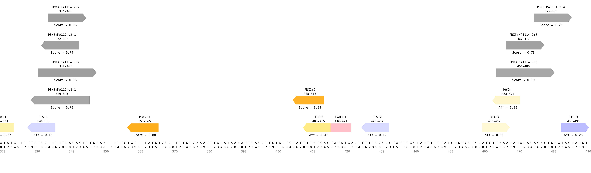
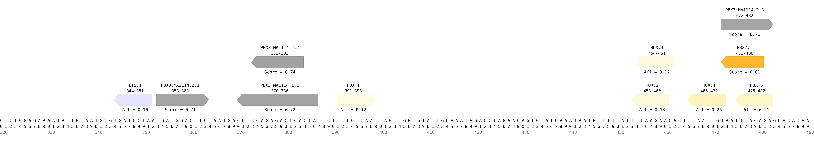

# tfsites.AnnotateAndVisualizeTFSites v2

**Author(s):** Joe Solvason  

**Contact:** Joe Solvason (solvason@eng.ucsd.edu)

**Adapted as a GenePattern Module by:** Ted Liefeld (jliefeld@cloud.ucsd.edu)

**Task Type:** Transciption factor analysis

**LSID:**  urn:lsid:genepattern.org:module.analysis:00442


## Introduction

`AnnotateAndVisualizeTfSites` annotates transcription factor binding sites across a DNA sequence. Multiple transcription factors can be analyzed. Each binding site is labeled with a unique binding site ID and its start and end position. If reference data is provided for a transcription factor, the affinity/score of this site will be labeled and the intensity of the binding site’s color will be proportional to the affinity/score.


## Methodology

Transcription factor information can be given in multiple ways. It can be provided in the TF information file and/or in the batch PFM custom file. For batch PFM data, there are several features that can be customized, including the minimum score, site color, and use of pseudocounts.

The two reference data types that can be provided are affinity (i.e. PBM) and score (i.e. PFM). To find predicted binding sites for PBM data, we iterate across every k-mer in the DNA sequence and identify those that conform to the binding site definition for each transcription factor. To find predicted binding sites for PFM data, we can also use a binding site definition but it is not required. If a site definition is not provided, we use the minimum score to define a predicted binding site. For each binding site, we report its sequence, TF name, matrix ID (if using the batch PFM custom option), start position, end position, reference data type, value (if reference data is given), direction (“+” if it follows the given binding site definition and “-” if it follows the reverse complement of the binding site definition), and a unique ID. The TFs given in the TF information file and batch PFM custom file are outputted in two separate files.

Using the list of binding sites predicted in the DNA sequence, an image of the DNA sequence and all annotated binding sites is generated. Each binding site is plotted as a polygon that points in the direction of the site (right for positive, left for negative, and straight for a palindrome sequence).  

If the user wishes to analyze only a portion of the sequence, then a zoom range can be specified. If the sequence is greater than 500 nucleotides in length, the sequence will automatically be separated into 500-bp windows and outputted as separate files. In addition, the individual files will be appended together to create a single output file with the entire sequence. 


## Parameters

<span style="color: red;">*</span> indicates required parameter

### Inputs and Outputs

- <span style="color: red;">*</span>**DNA sequence(s) to annotate (.tsv)**
    - File containing one or more DNA sequences to be annotated. 
- **TF information (.tsv)**
    - File containing all the information for the transcription factors being analyzed.
- **TF affinity reference data**
    - File(s) referenced in the TF information file.
- **batch PFM custom (.txt)**
    - File containing all PFM matrices to predict binding sites.
 
### PFM Parameters
- **batch PFM minimum score (float)**
    - `Default = 0.7`
    -  Required PFM score to predict a site. Does not apply to PFMs referenced in the “TF information” file. 
- **batch PFM predicted site color (string)**
    - `Default = grey`
    - Color of sites for PFMs. Find color options [here](https://matplotlib.org/stable/gallery/color/named_colors.html). 
- **use pseudocounts to calculate score (boolean)**
    - `Default = False`
    - Choose if you want to use pseudocounts. Find description of pseudocounts [here]().

### Plotting Parameters
- **output svg (boolean)**
    - `Default = False`
    - Option to output images as SVG in addition to PNG. SVG are preferable for manuscript preparation.
- **plot resolution (integer)**
    - `Default = 200`
    - Resolution of the plot, in dots (pixels) per inch.
- **zoom range (dash-separated string)**
    - `Default = None`
    - Given a start position and an end position, zoom into a portion of the sequence. The numbers in the range are inclusive and 1-indexed. For example, the first 200 nucleotides of the sequence would be specified as: 1-200.
  
## Input File(s)

1.  DNA sequence(s) to annotate (.tsv)
- Columns:
    - `Sequence Name:` name of the DNA sequence
    - `Sequence:` the sequence
 
```
Sequence Name	    Sequence
ZRS                 AACTTTAATGCCTATGTTTGATTTGAAGTCATAGCATAAAAGGTAACATAAGCAACATCCTGACCAATTATCCAAACCATCCAGACATCCCTGAATGGC...
Hand2               CACCACTGGGTGATCCATAGTATGGAATATTTTTATGAGAAACAGCCACATAACATGTACCTGTTAATGTAGGCTTTGTGTTTATTTGCAATAGCAGAG...
```

2. TF information (.tsv)
- Columns:
    - `TF Name:` name of the transcription factor
    - `Color:` binding site color on the output visualization
    - `Binding Site Definition:` minimal IUPAC binding site definition for transcription factor (optional)
    - `Reference Data:` relative affinity data obtained from `DefineTfSites.from.PBM` or relative score data (optional)
    - `Minimum Score:` threshold required to predict a binding site using PFM scoring (optional)
    - `Minimum Affinity:` threshold required to plot binding sites above a certain affinity (optional)
 
```
TF Name    Color       Binding Site Definition    Reference Data                Minimum Score   Minimum Affinity
ETS        blue        NNGGAWNN                   input_ets1-pbm.tsv    
HOX        gold        NYNNTNAA                   input_hoxa13-pbm.tsv                          0.12
HAND       pink        CANNTG
PBX2       orange                                 input_MA1113.3-pbx2-pfm.txt   0.8
```
    
3. all TF reference data (.tsv)
- Can provide more than one file

ETS
```
PBM Kmer     PBM Relative Affinity
AAAAAAAA     0.15
AAAAAAAC     0.11
AAAAAAAG     0.13
AAAAAAAT     0.13
AAAAAACA     0.12
```

HOX
```
PBM Kmer     PBM Relative Affinity
AAAAAAAA     0.55
AAAAAAAC     0.56
AAAAAAAG     0.54
AAAAAAAT     0.54
AAAAAACA     0.56
```

PBX2
```
>MA1113.3	PBX2
A  [  4925  26620    225  24368  27245  27259    704   2298  25945 ]
C  [ 19645    629    588   2266    574    754    453  23894    848 ]
G  [  1585   1710    317    817    343    569    327    555    352 ]
T  [  3441    637  28466   2145   1434   1014  28112   2849   2451 ]
```

4. batch PFM custom input (.jaspar)
- Can provide multiple PFMs 

```
>MA1114.1	PBX3
A  [  1595   1510   1320    596    228   6426    335    247    146   6164    150   6091    369    884   1251   1869   1495 ]
C  [  1711   1724   1849    225    227    125    788    199    242    108   6524    129    412   1377   2654   1619   1801 ]
G  [  2192   1934   1928    503   6406    214   4929    285   6550    604    209    425   5691   4077   1591   2068   2217 ]
T  [  1523   1853   1924   5697    160    256    969   6290     83    145    138    376    549    683   1525   1465   1508 ]
>MA1114.2	PBX3
A  [   596    228   6426    335    247    146   6164    150   6091    369    884 ]
C  [   225    227    125    788    199    242    108   6524    129    412   1377 ]
G  [   503   6406    214   4929    285   6550    604    209    425   5691   4077 ]
T  [  5697    160    256    969   6290     83    145    138    376    549    683 ]
...
```
       
## Output File(s)

1.  TF sites output tables (.tsv)
- Columns
    - `Sequence Name:` Name of the sequence
    - `TF Name:` Name of the transcription factor
    - `Matrix ID:` PFM matrix ID from JASPAR (optional)
    - `Kmer ID:` unique ID associated with each k-mer
    - `Kmer:` sequence of the k-mer
    - `Start Position (1-indexed):` starting position of the k-mer, where counting begins at one
    - `End Position (1-indexed):` starting position of the k-mer, where counting begins at one
    - `Ref Data Type:` either 'Affinity' or 'Score' depending on type of data being used (optional)
    - `Value:` relative affinity or score of the k-mer (optional)
    - `Site Direction:` direction of the binding site 
    - `Duplicate Kmer IDs:` list of k-mer IDs for k-mers that have the same sequence

tf info table
```
Sequence Name    TF Name     Kmer ID      Kmer                Start Position (1-indexed)    End Position (1-indexed)  Ref Data Type   Value    Site Direction   Duplicate Kmer IDs
ZRS              ETS         ETS:1        CTATCCTG            335                           328                       Affinity        0.15     -
ZRS              ETS         ETS:2        TTTTCCCC            432                           425                       Affinity        0.14     -                ETS:1,ETS:20
ZRS              HOX         HOX:1        TTTAATAT            323                           316                       Affinity        0.75     -	
ZRS              HOX         HOX:2        TTTATGAC            415                           408                       Affinity        0.84     -
ZRS              HAND        HAND:1       CAGATG              416                           421
ZRS              PBX2        PBX2:1       AATTAATTA           217                           209                       Score           0.83     -	
ZRS              PBX2        PBX2:2       CATAAACCA           365                           357                       Score           0.88     -
```

batch pfm custom
```
Sequence Name    TF Name     Matrix ID    Kmer ID             Kmer                 Start Position (1-indexed)    End Position (1-indexed)  Ref Data Type   Value   Site Direction   Duplicate Kmer IDs
ZRS              PBX3        MA1114.1     PBX3:MA1114.1:1     AACTGTGACACAGGATA    345                           329                       Score           0.7     -	
ZRS              PBX3        MA1114.1     PBX3:MA1114.1:2     TCCTGTGTCACAGTTTG    331                           347                       Score           0.76    +
ZRS              PBX3        MA1114.2     PBX3:MA1114.2:1     GGATTAAGAGG          123                           133                       Score           0.7     +	
ZRS              PBX3        MA1114.2     PBX3:MA1114.2:2     GGACTGACCAG          218                           228                       Score           0.71    +
```


2.  annotated sequence image(s) (.png)

- ZRS sequence: 
   

- Hand2 sequence:
   
    
  
## Example Data

[Example input data is available on github](https://github.com/genepattern/tfsites.annotateTfSites/data)

    
## Version Comments

- **1.0.0** (2023-01-12): Initial draft of document scaffold.
- **1.0.1** (2024-02-02): Draft completed.
