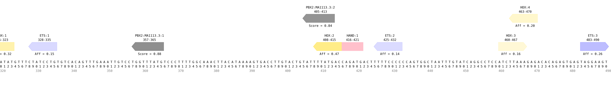

# tfsites.VisualizeTfSitesOnSequences v1

**Author(s):** Joe Solvason  

**Contact:** Joe Solvason (solvason@eng.ucsd.edu)

**Adapted as a GenePattern Module by:** Ted Liefeld (jliefeld@cloud.ucsd.edu)

**Task Type:** Transciption factor analysis

**LSID:**  urn:lsid:genepattern.org:module.analysis:00442


## Introduction

`VisualizeTfSitesOnSequences` annotates transcription factor binding sites across a DNA sequence. Multiple transcription factors can be analyzed. Each binding site is labeled with a unique binding site ID and its start and end position. If reference data is provided for a transcription factor, the affinity/score of this site will be labeled and the intensity of the binding site’s color will be proportional to the affinity/score.


## Methodology

Transcription factor information can be given in multiple ways. It can be provided in the TF information file and/or in the PWM data file. For PWM data, there are several features that can be customized, including the minimum score and site color.

The two reference data types that can be provided are affinity (i.e. PBM) and score (i.e. PWM). To find predicted binding sites for affinity data, we iterate across every k-mer in the DNA sequence and identify those that conform to the binding site definition for each transcription factor. To find predicted binding sites for PWM data, we can also use a binding site definition but it is not required. If a site definition is not provided, we use the minimum score to define a predicted binding site. For each binding site, we report its sequence, TF name, matrix ID (if using PWM data), start position, end position, reference data type, value (if reference data is given), direction (“+” if it follows the given binding site definition and “-” if it follows the reverse complement of the binding site definition), and a unique ID. The TFs given in the TF information file and PWM data file are outputted in two separate files.

Using the list of binding sites predicted in the DNA sequence, an image of the DNA sequence and all annotated binding sites is generated. Each binding site is plotted as a polygon that points in the direction of the site (right for positive, left for negative, and straight for a palindrome sequence).  

If the user wishes to analyze only a portion of the sequence, then a zoom range can be specified. If the sequence is greater than 500 nucleotides in length, the sequence will automatically be separated into 500-bp windows and outputted as separate files. In addition, the individual files will be appended together to create a single output file with the entire sequence. 


## Parameters

<span style="color: red;">*</span> indicates required parameter

### Inputs and Outputs

- <span style="color: red;">*</span>**DNA sequence(s) to annotate (.tsv)**
    - File containing one or more DNA sequences to be annotated. 
- **TF affinity information (.tsv)**
    - File containing all the information for the transcription factors being analyzed. This includes the TF name, color, binding site definition, affinity reference data (optional), and minimum affinity (optional).
- **batch motif input file (.txt)**
    - File containing PWMs to predict and score binding sites.
- **PWM minimum score (float)**
    - `Default = 0.7`
    - PWM score required to predict a binding site. 
- **PWM binding site color (string)**
    - `Default = grey`
    - Color of sites scored by PWMs on the output visualization. Find color options [here](https://matplotlib.org/stable/gallery/color/named_colors.html). 

### Other Parameters
- **output image as svg (boolean)**
    - `Default = False`
    - Option to output images as `.svg` in addition to `.png`. For manuscript preparation, `.svg` format is preferable.
- **plot resolution (integer)**
    - `Default = 150`
    - Resolution of the plot, in dots (pixels) per inch. Manuscripts require 300 DPI. The DPI does not affect the resolution of `.svg` files.
- **zoom range (dash-separated string)**
    - `Default = None`
    - Given a start position and an end position, zoom into a portion of the sequence. The numbers in the range are inclusive and 1-indexed. For example, the first 200 nucleotides of the sequence would be specified as: 1-200.
  
## Input File(s)

1.  DNA sequence(s) to annotate (.tsv)
- Columns:
    - `Sequence Name:` name of the DNA sequence
    - `Sequence:` the sequence
 
```
Sequence Name	    Sequence
ZRS                 AACTTTAATGCCTATGTTTGATTTGAAGTCATAGCATAAAAGGTAACATAAGCAACATCCTGACCAATTATCCAAACCATCCAGACATCCCTGAATGGC...
```

2. TF affinity information (.tsv)
- Columns:
    - `TF Name:` name of the transcription factor
    - `Color:` binding site color on the output visualization
    - `Core Site:` minimal IUPAC binding site definition for transcription factor 
    - `Affinity Data:` relative affinity data obtained from `DefineTfSites` or relative score data (optional)
    - `Minimum Affinity:` threshold required to plot binding sites above a certain affinity (optional)
 
```
TF Name    Color       Core Site    Affinity Data            Minimum Affinity
ETS        blue        NNGGAWNN     input_ets1-pbm.tsv    
HOX        gold        NYNNTNAA     input_hoxa13-pbm.tsv     0.12
HAND       pink        CANNTG
```
    
3. all TF affinity reference data (.tsv)
- Can provide more than one file

ETS
```
Kmer         Relative Affinity
AAAAAAAA     0.15
AAAAAAAC     0.11
AAAAAAAG     0.13
AAAAAAAT     0.13
AAAAAACA     0.12
```

HOX
```
Kmer         Relative Affinity
AAAAAAAA     0.55
AAAAAAAC     0.56
AAAAAAAG     0.54
AAAAAAAT     0.54
AAAAAACA     0.56
```

4. PWM data (.txt)
- Can provide multiple PWMs 

```
>MA1113.3	PBX2
A  [  4925  26620    225  24368  27245  27259    704   2298  25945 ]
C  [ 19645    629    588   2266    574    754    453  23894    848 ]
G  [  1585   1710    317    817    343    569    327    555    352 ]
T  [  3441    637  28466   2145   1434   1014  28112   2849   2451 ]
```
       
## Output File(s)

1.  annotated sequence table(s) (.tsv)
- Columns
    - `Sequence Name:` Name of the sequence
    - `TF Name:` Name of the transcription factor
    - `Matrix ID:` PWM ID from JASPAR (optional)
    - `Kmer ID:` unique ID associated with each k-mer
    - `Kmer:` sequence of the k-mer
    - `Start Position (1-indexed):` starting position of the k-mer, where counting begins at one
    - `End Position (1-indexed):` starting position of the k-mer, where counting begins at one
    - `Ref Data Type:` either 'Affinity' or 'Score' depending on type of data being used (optional)
    - `Value:` relative affinity or score of the k-mer (optional)
    - `Site Direction:` direction of the binding site 
    - `Duplicate Kmer IDs:` list of k-mer IDs for k-mers that have the same sequence

tf info table
```
Sequence Name    TF Name     Kmer ID      Kmer                Start Position (1-indexed)    End Position (1-indexed)  Ref Data Type   Value    Site Direction   Duplicate Kmer IDs
ZRS              ETS         ETS:1        CTATCCTG            335                           328                       Affinity        0.15     -
ZRS              ETS         ETS:2        TTTTCCCC            432                           425                       Affinity        0.14     -                ETS:1,ETS:20
ZRS              HOX         HOX:1        TTTAATAT            323                           316                       Affinity        0.75     -	
ZRS              HOX         HOX:2        TTTATGAC            415                           408                       Affinity        0.84     -
ZRS              HAND        HAND:1       CAGATG              416                           421
```

pfm data
```
Sequence Name    TF Name     Matrix ID    Kmer ID             Kmer                 Start Position (1-indexed)    End Position (1-indexed)  Ref Data Type   Value   Site Direction   Duplicate Kmer IDs
ZRS              PBX2        MA1113.3     PBX2:MA1113.3:1     CATAAACCA            365                           357                       Score           0.88    -	
ZRS              PBX2        MA1113.3     PBX2:MA1113.3:2     CATAAAATA            413                           405                       Score           0.84    -
```


2.  annotated sequence image(s) (.png)


    
  
## Example Data

Example input data is available at [here]()

    
## Version Comments

- **1.0.4** (2024-11-21): Updated for tfsites website.
- **1.0.3** (2024-10-17): Third draft completed.
- **1.0.2** (2024-09-12): Second draft completed. Updated parameters and visualizations.
- **1.0.1** (2024-02-02): Draft completed.
- **1.0.0** (2023-01-12): Initial draft of document scaffold.
